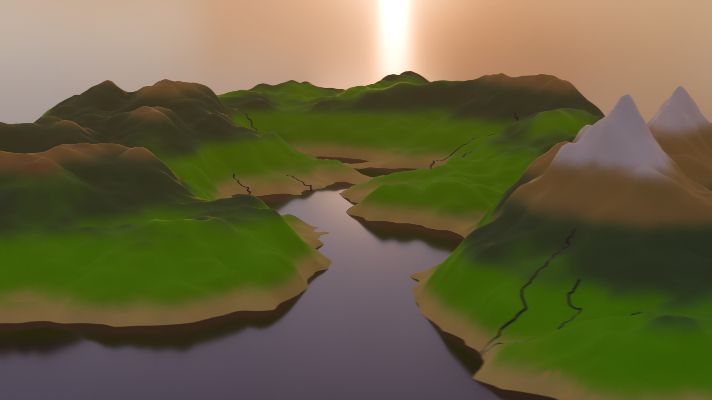
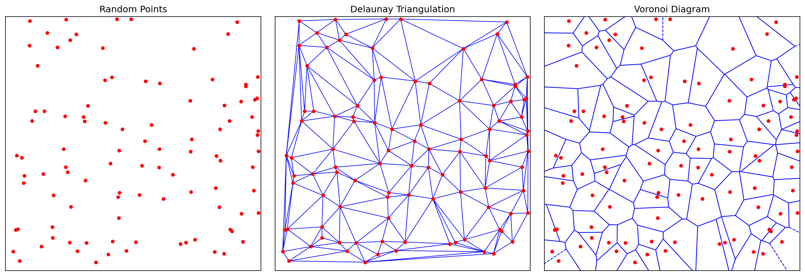
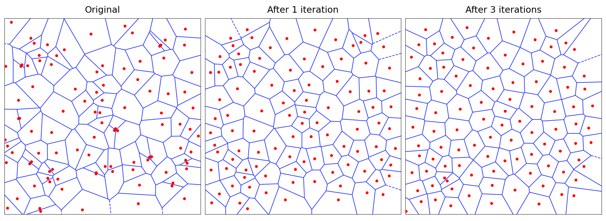
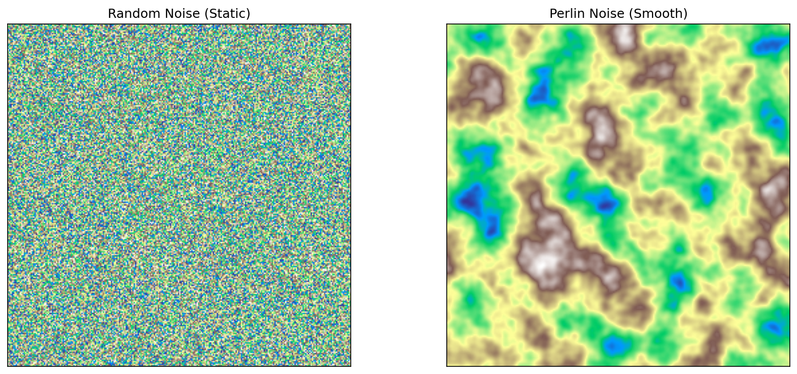
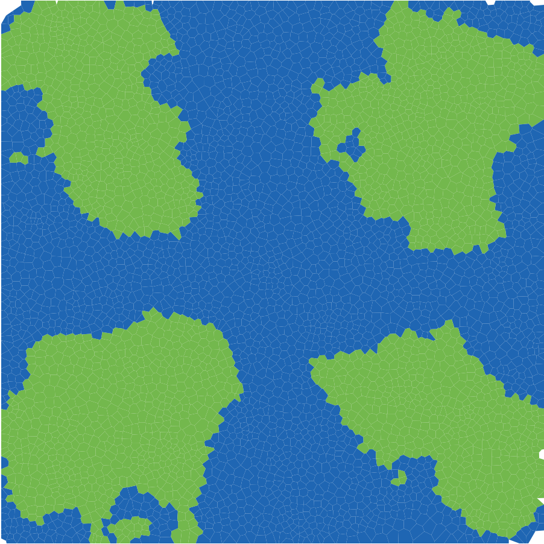
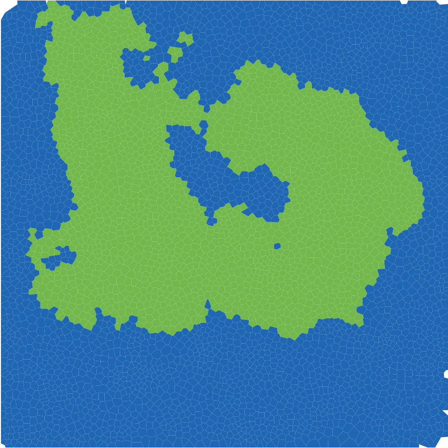
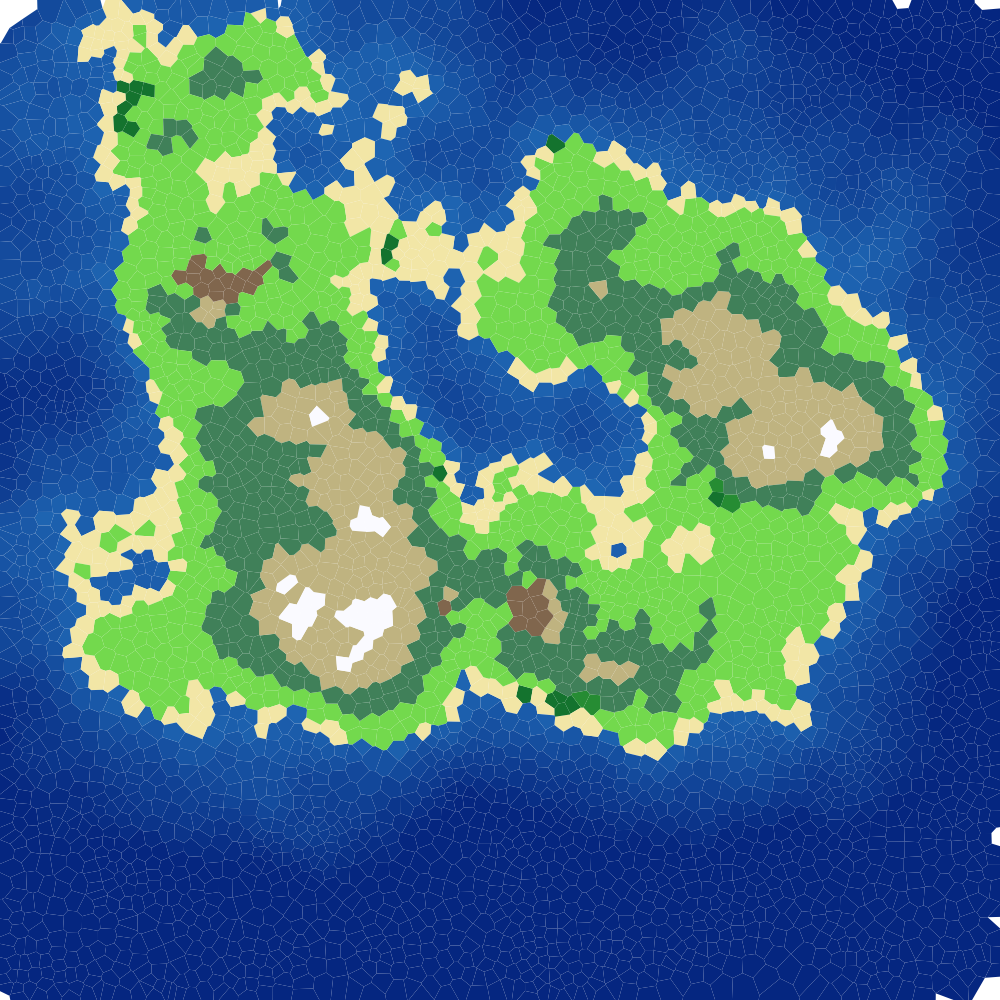
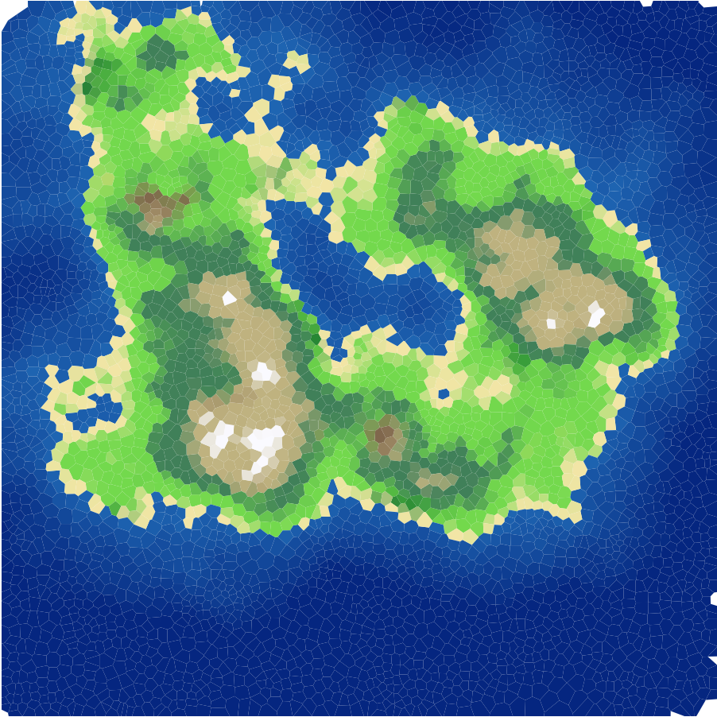
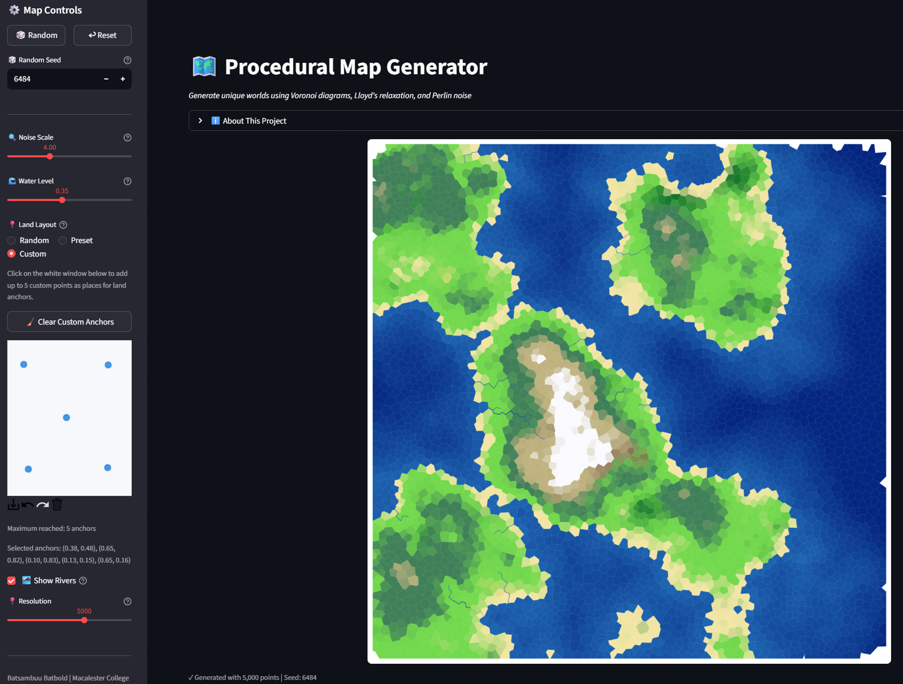
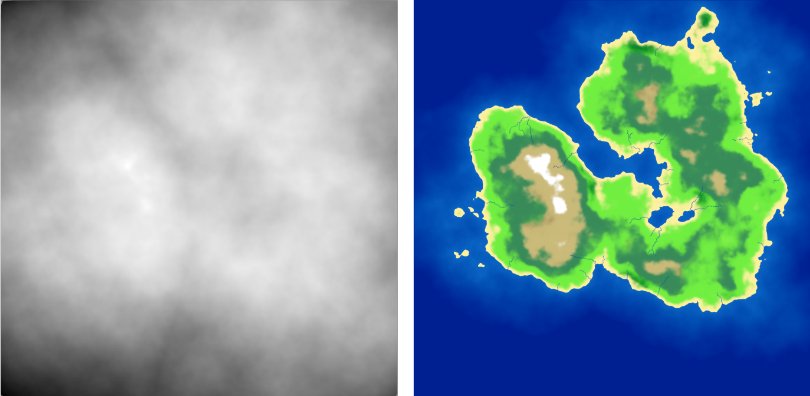

# Introduction

As a fan of open-world and simulation video games, the setting and environment are the biggest factors in deciding if a virtual world is worth my time. We, as players, expect vast, immersive, and explorable worlds that offer a unique experience. Who wants to keep coming back to the same place if it offers nothing new? However, hand-crafting these worlds is a huge task. It often takes longer to build than it takes to walk across them. This is why **Procedural Content Generation** (PCG) is essential to reduce creation time and increase replayability.

Every game has its own unique story and gameplay, requiring different types of worlds. Traditional PCG methods often use square grids (like Minecraft) or hexagons (like Civilization). While these are computationally easy to handle, they obviously lack a natural feel. I wanted terrain that feels organic and looks natural, but follows consistent rules to satisfy my specific vision.

**I wanted *my world* to be shaped in *my way*.**

In this project, we explore a way to procedurally generate a 3D terrain using computational geometry:

1. First, we generate a 2D map, adapting ideas from Amit Patel's **Red Blob Games** [@patel2015polygonal] and tweaking the logic to fit our specific goals.
2. Then, we prepare and convert the 2D map data into a heightmap for 3D terrain.
3. Finally, we transfer the data to Blender to render and build the cinematic world.

---

# Stage 1: Chaos

It all starts with the chaos of random points.

To generate a 2D map, we first need small cells that essentially serve as the "pixels" or building blocks of our world. However, as mentioned earlier, usual square and hexagonal grids don’t result in realistic looking landscapes. Using polygons of varying shapes helps us generate a map that feels less like a machine made it and more organic.

So, we call upon our old friend: the **Voronoi Diagram**.

## Voronoi Diagram

Given a point cloud $S$ on a plane, a Voronoi Diagram partitions the plane into regions. For any given point $p$, its Voronoi region consists of all points in the plane that are closer to $p$ than to any other point. Mathematically:

$$
\text{Vor}(p) = \{x \in \mathbb{R}^2 \:| \: \|x-p\| \leq \|x-q\| \text{ for all } q \in S \}
$$

These regions create convex polygons that tile the plane. In the context of terrain generation, each of these Voronoi regions becomes a distinct territory: a patch of forest, a slice of ocean, or a mountain peak. To actually compute these regions in code, we turn to the dual of the Voronoi diagram: the **Delaunay Triangulation**.

## Delaunay Triangulation

Delaunay Triangulation is defined as a triangulation of a set of points where no point is inside the circumcircle of any triangle. It is mathematically linked to the Voronoi Diagram via duality. If we connect every pair of points whose Voronoi regions share an edge, we get the Delaunay Triangulation. Conversely, the circumcenters of the Delaunay triangles serve as the vertices of the Voronoi diagram.

For the implementation, I used the popular existing library `delaunator` [@delaunator]. It computes the triangulation efficiently, allowing us to derive the Voronoi region boundaries from the triangle centers.

{#fig-vor-del}

As seen in @fig-vor-del, the polygons look nice and random. However, they might be *too random*. True randomness is clumpy. We end up with tiny slivers of polygons right next to massive, stretched-out ones. This is too chaotic to be a skeleton for a game world. We want the terrain to be somewhat smoother and more uniform, mimicking the natural look of the real world. To fix the clumping, we use **Lloyd's Relaxation** [@lloyd_wolfram], also known as Voronoi iteration.

## Lloyd's Relaxation

Lloyd's Relaxation is a simple algorithm that moves the random points to space them out evenly:

1. Compute the Voronoi Diagram of the current points.
2. Calculate the centroid of each Voronoi region.
3. Move the point to that centroid.
4. Repeat.

By repeating this process a few times, the points naturally space themselves out. After each iteration, the Voronoi cells become more uniform, ultimately resembling a turtle shell like pattern. I used the existing package `lloyd` [@lloyd_repo] to handle this calculation.

{#fig-lloyd}

Now, our grid is done, and it's time to create the land.

---

# Stage 2: Creation

We have our grid, which acts as the skeleton of our world. Now, we need to assign which tiles are land and which are ocean. To do this, I assign an altitude value to every Voronoi region. If the altitude is higher than a user-defined water level threshold, it becomes a land tile; otherwise, it is an ocean tile.

Again, we want the land to look random but natural. However, there is a huge problem with randomly assigning altitude. If we were to do that, the world would look like "TV static" because every tile would be independent of its neighbors. A deep ocean tile might sit right next to a high mountain peak, which is physically impossible. Real terrain is continuous and gradual: mountains roll into hills, and coastlines gradually descend into the ocean.

We need *smooth randomness*. To solve this, we use **Perlin Noise** [@perlin1985].

## Perlin Noise

Perlin Noise is an algorithm invented by Ken Perlin to generate natural-looking textures for movies. In 1997, Perlin received an Academy Award (Scientific and Technical Achievement) for the development of this algorithm [@oscar_perlin].

Unlike standard random numbers, Perlin noise is coherent. If you pick a point on a Perlin noise map, the neighbor points around it will have very similar values, creating gradual transitions.

{#fig-noise}

As seen in @fig-noise, the algorithm results in a cloud-like pattern that already looks like a map. For the implementation, I used the Python package **pnoise** [@pnoise].

After assigning Perlin noise as a base altitude, I made some customizations to shape the world exactly how I wanted. Raw Perlin noise doesn't know by itself where an island should be. To fix this, I implemented a two-step shaping process:

* **Land Centers**: I scatter a number of anchor points (land centers) across the grid. To ensure the land clusters around these anchors, I apply a distance penalty: the further a tile is from a land center, the lower its altitude becomes. This forces the noise to fade into the ocean as it gets further from the center, creating distinct island shapes rather than an infinite continent. By default, these anchors are placed randomly, but I also added an option to choose from preset layouts. For example, placing anchors at the four corners gives us four distinct islands, or placing one in the center gives a single continent.

{#fig-anchors width=75%}

<!-- TODO: update custom-land-only.png if you change the seed or layout -->

* **The Power Curve**: Finally, I apply a non-linear adjustment to the height profile. I wanted flat, gentle slopes around the coastline for beaches and plains but much steeper, dramatic rises in the center. I achieved this by applying a power curve to the land values.
```{python}
#| eval: false
#| code-fold: true
#| code-summary: "Show Python Implementation"

def assignAltitudes(self):
    """
    Set per-region elevation using Perlin noise + land-anchor falloff.
    Supports both random and user-defined anchor placement.
    """
    # Scale point coordinates to control feature size in noise space
    scaled_pts = self.points / self.grid_size * self.noise_scale
    # Generate Perlin noise with 6 octaves (layers of detail),
    # then shift from [-1, 1] to [0, 1] range
    noise_vals = np.array([(pnoise2(x, y, octaves=6) + 1) / 2
                           for x, y in scaled_pts])

    # Use user-provided anchors, or scatter random ones within
    # the inner 20%-80% of the grid to keep land away from edges
    if self.custom_anchors is not None:
        anchors = np.array(self.custom_anchors) * self.grid_size
    else:
        anchors = np.random.uniform(0.2, 0.8, (self.land_centers, 2)) * self.grid_size

    # For each tile, find the distance to the nearest anchor
    # and normalize it relative to half the grid size
    all_dists = np.array([np.linalg.norm(self.points - c, axis=1) for c in anchors])
    normalized_dists = np.min(all_dists, axis=0) / (self.grid_size / 2)
    # Subtract squared distance - quadratic falloff pushes
    # tiles far from anchors below the water level
    base_alt = noise_vals - normalized_dists ** 2

    # Piecewise power curve: gentle near coast, steep inland
    land_mask = base_alt > self.water_level
    self.altitudes = base_alt.copy()
    land_vals = base_alt[land_mask]
    # Normalize land heights to [0, 1] above water level
    land_norm = np.clip((land_vals - self.water_level) / (1.0 - self.water_level), 0, 1)

    # Below 35% = coastal zone: flatten to 80% of original height
    coastal = land_norm < 0.35
    sharpened = np.empty_like(land_norm)
    sharpened[coastal] = land_norm[coastal] * 0.8
    # Above 35% = inland: start at 0.28 (= 0.35*0.8),
    # then rise steeply with exponent 1.3, amplified by 3x
    sharpened[~coastal] = 0.28 + np.power(land_norm[~coastal] - 0.35, 1.3) * 3
    # Map shaped values back to the full altitude range
    self.altitudes[land_mask] = self.water_level + sharpened * (1.0 - self.water_level)
```


## Biome Assignment

With the heightmap complete, we have a basic definition of land and sea.

{#fig-land width=75%}

@fig-land is a convincing start, it resembles a landmass. However, the land is all one color and boring. Real-world terrain is vibrant: we have forests, deserts, snowy peaks, and swamps. In short, we have **biomes**. 

Our initial strategy relied solely on altitude. While altitude separates ocean from land, it isn't enough to distinguish a Desert from a Rainforest. They might be at the same height, but they look completely different. The missing variable is Moisture. To simulate this, I generated a second Perlin Noise map specifically for moisture. I then applied environmental modifiers to make it physically plausible:

* **Proximity to water**: Tiles closer to the ocean received a moisture boost.
* **Elevation Adjustment**: High-altitude areas generally became drier, though I added a special exception to ensure the very highest peaks retained enough "moisture" value to support snow caps.

By combining these two values (Altitude and Moisture), we can classify every tile into a specific biome. I implemented a Whittaker-style biome classification [@whittaker_diagram], similar to Red Blob Games [@patel2015polygonal], resulting in 10 distinct biome types. For example:

* High Altitude + Low Moisture $\rightarrow$ Scorched / Rocky Mountain
* High Altitude + High Moisture $\rightarrow$ Snow
* Mid Altitude + High Moisture $\rightarrow$ Forest
* Low Altitude + Low Moisture $\rightarrow$ Desert

{#fig-rigid-biomes width=75%}

However, as seen in @fig-rigid-biomes, using this rigid classification directly looks little off. The boundaries between biomes are sharp because a tile is either 100% forest or 100% desert with no in-between. Real nature doesn't work like that. To fix this, I used a three-step pipeline:

1. **Lookup Table (LUT)**: I evaluate the Whittaker classification on a $256 \times 256$ grid (elevation × moisture), producing a hard-edged biome color map.

2. **Gaussian Blur** [@gaussian_blur]: Using SciPy's `gaussian_filter`, I blur the table with a Gaussian kernel ($\sigma = 8$). This dissolves the sharp boundaries into smooth gradients - a forest fades into grassland instead of cutting off abruptly.

3. **Bilinear Interpolation**: When looking up a tile's color, I interpolate between the four surrounding cells in the blurred table instead of snapping to the nearest one, removing any remaining banding.

```{python}
#| eval: false
#| code-fold: true
#| code-summary: "Show Biome Coloring Pipeline"

def _build_biome_table(self) -> None:
    """Pre-compute a Gaussian-blurred biome color LUT indexed by (elevation, moisture)."""
    res = self.BIOME_TABLE_RES  # 256x256 grid resolution
    table = np.zeros((res, res, 3))  # RGB color for each (elev, moisture) pair

    # Fill every cell with the hard Whittaker biome color
    for i in range(res):
        for j in range(res):
            # Normalize indices to [0, 1] for elevation and moisture
            table[i, j] = self._get_raw_biome_color(i / (res - 1), j / (res - 1))

    # Blur each color channel separately; sigma=8 controls
    # how wide the transition zones are between biomes.
    # mode='nearest' repeats edge colors instead of fading to black
    for c in range(3):
        table[:, :, c] = gaussian_filter(table[:, :, c], sigma=8.0, mode='nearest')

    self._biome_table = table


def get_color(self, alt, moisture):
    """Return a smoothly blended biome color using the blurred lookup table."""
    if alt < self.water_level:
        # Ocean tiles: blend between shallow and deep blue based on depth
        depth = np.clip((self.water_level - alt) / self.water_level, 0, 1)
        t = depth ** 0.7  # power < 1 brightens shallow areas for coastal contrast
        return tuple(shallow * (1 - t) + deep * t)

    # Land tiles: map altitude and moisture to table coordinates
    e = np.clip((alt - self.water_level) / 0.25, 0, 1)  # normalize land elevation
    m = np.clip(moisture, 0, 1)

    # Convert to table indices and interpolate between 4 neighbors
    ei = int(e * (res - 1))
    mi = int(m * (res - 1))
    # ... bilinear interpolation between 4 neighboring table entries ...
    return tuple(color)
```

{#fig-biomes width=75%}

As seen in @fig-biomes, the map is now visually diverse. We see sandy beaches along the coastline, green forests filling the midlands, and white snow capping the highest peaks. Thanks to the Gaussian blur on the biome table, the transitions between biomes are smooth and gradual rather than abrupt.

## River Network

With biomes in place, the map was looking good, but something was still missing - rivers. Real landscapes have water flowing from mountains down to the ocean, and adding that would bring the map to life.

I implemented a river system using the Voronoi mesh structure. The idea is to use the connections between Voronoi vertices (the circumcenters of the Delaunay triangles) as potential river channels. Here is how it works:

1. **Priority-Flood Flow Routing** [@BARNES2014117]: Starting from all ocean vertices, the algorithm floods outward using a min-heap (priority queue), always processing the lowest-elevation vertex first. Each visited vertex records where it was reached from, creating a flow-to pointer. This builds a spanning tree where every land vertex has a single downhill path to the sea.

2. **Flow Accumulation**: Starting from the highest vertices, each one passes its accumulated count downstream. Vertices near mountaintops have low counts, while those near the coast collect from hundreds of upstream sources. This count directly controls river width and opacity - thicker lines for major rivers, thin faint lines for small streams.

3. **Two-Pass Source Selection**: In the first pass, I look for points that both collect strong upstream flow and lie far from the sea, so they can form long main rivers. We rank those points with a score that combines flow and distance-to-sea (`score = flow_acc * (1 + path_len / max_len)`), then keep the highest-ranked ones as starting points, and trace each one downstream to the ocean to form a full river path. In the second pass, we repeat the same process with looser thresholds to add shorter tributaries and improve overall drainage coverage. In both passes, we use an occupancy grid: once a river path is chosen, nearby candidate sources are blocked so rivers do not cluster too tightly.

The rivers are drawn with width and opacity scaled by their flow accumulation - wider, more visible lines for major rivers and thin, faint lines for small streams.

{#fig-rivers width=75%}

As seen in @fig-rivers, the rivers add a lot of life to the map. They naturally follow the terrain, flowing downhill from the peaks and reaching the ocean.

---

## 2D Interactive Playground

Up to this point, I was happy with the logic of my 2D map. However, tuning the parameters to get the exact look I wanted required endless tweaking. It became incredibly annoying to re-run the entire script every time I wanted to change a noise value by $0.1$. So, I built an interactive dashboard to visualize the changes in real-time. Since the tool was so useful for debugging, I decided to host it publicly on Streamlit so you can try it yourself.

[**🔗 Click Here to Try the Interactive Map Generator**](https://basabu1-map-generation-app-fut9qy.streamlit.app/)

The app gives you control over the key generation parameters:

* **Random Seed**: Change this to generate a completely different world layout.
* **Noise Scale**: Controls the "zoom" of the features. Higher values create chaotic, fragmented terrain; lower values create massive continents.
* **Water Level**: Raises or lowers the ocean. Higher values result in archipelagos; lower values create super-continents.
* **Land Centers**: The number of anchor points that shape the landmasses.
* **Land Layout**: Switch between random anchor placement, preset layouts (like 4 Corners, Center Island, or Two Continents), and custom positions to control where land forms.
* **Resolution**: The number of Voronoi cells. More points = finer detail (but slower generation).

For example, here is what the interactive app looks like with 5 custom land centers placed in a "cross" pattern:

{#fig-app}


With this tool in hand, the 2D phase of the project is complete. We have the map, we have the biomes, we have the rivers, and we have the controls. Now, it is time to add the third dimension.

---

# Stage 3: Continents

In the 2D map, I assigned colors based on the altitude of each Voronoi region. However, a flat map can only tell us so much. To fully utilize the altitude data and satisfy my curiosity about what this world would look like as a real landscape, I decided to move into the third dimension.

I chose **Blender**, a free and open-source 3D creation software, to render the map. Blender is a widely used tool for visual effects and modeling. Notably, the animated film *Flow*, which won an Academy Award in 2025, was created using Blender [@oscar_2025].

## Transfer to 3D

To use Blender, I first needed to export my Python data into a format the software could understand. Blender generates terrain using a **Heightmap**: a grayscale image where black represents the ocean floor and white represents the highest mountain peaks. It also needs a **Colormap** to paint the surface. On top of that, I also export a **River Mask** so the Blender shader can make rivers look wet and reflective, distinct from the surrounding terrain.

I wrote a script using the **Python Imaging Library (PIL/Pillow)** [@pillow] to export these textures directly from my generation code. The heightmap is saved as a 16-bit grayscale image for maximum precision. Rivers are painted onto the colormap and exported as a separate mask. This keeps the 3D terrain smooth while still showing rivers visually.

```{python}
#| eval: false
#| code-fold: true
#| code-summary: "Show Heightmap Export Code"

# Interpolate per-region altitudes onto a regular pixel grid
heights = self._interpolate_grid(self.altitudes, resolution, fill_value=0)

# Normalize to 0.0 - 1.0
h_min, h_max = heights.min(), heights.max()
if h_max - h_min > 0:
    heights = (heights - h_min) / (h_max - h_min)

# Save as 16-bit grayscale for maximum elevation precision
heights_16 = (heights * 65535).astype(np.uint16)
img = Image.fromarray(heights_16, mode="I;16")
img.save("heightmap.png")
```


<!-- TODO: update height-colormap.png -->
{#fig-export}

@fig-export shows the raw output of this process. The grayscale heightmap controls the geometry, while the colored map paints the surface. The river mask is also exported alongside these so the Blender shader can apply different material properties (lower roughness, higher reflectivity) to rivers.

## 3D Result

After importing these images into Blender and applying a Displacement Modifier to a plane, the flat grid transformed into a rough terrain.

<video width="100%" controls>
  <source src="figures/rendered-video.mp4" type="video/mp4">
</video>

As seen in the video, moving to 3D reveals details that were invisible in 2D. We can see the steepness of the mountain summits, the gradual coastlines, rivers cutting through valleys, and how biomes change based on altitude. Overall, I'm quite happy with how far this project has come.

---

# Discussion and Conclusion

## Key Insights

Through this project, I learned that making a world is a mix of math and art. I was surprised to see that pure randomness is actually ugly. The Voronoi diagram gave the map a shape, but Perlin noise made it smooth. You really need both to make it look real. Also, Lloyd's Relaxation was the small but key step. I didn't expect it to change much, but it turned a messy bunch of polygons into a clean, nice-looking grid that still felt organic. Adding rivers was another big jump - the map went from looking like a colored diagram to feeling like an actual landscape.

Finally, working in 2D was good for starting and fixing the code, but putting it into Blender finally showed me how the world really feels. However, due to the steep learning curve of Blender, I could do only a little without spending too much time on it.


## Limitations and Future Work

Even though the results look cool, there are a few things I wish I could improve with more time. My biomes look at height and moisture with smooth Gaussian transitions between them, which works well visually, but real nature is more complex - wind, temperature, and seasonal changes all play a role.

As I made the map bigger with more points, the code got slower. Python is easy to write and NumPy is fast for some operations, but for a huge game world, I might need a faster language like C++. In the future, I want to add erosion simulation and put the 3D model into a game engine like Unity. That way, I could actually walk around in the world I built.


## Final Summary

At the start, I said that making worlds by hand takes too long and grids look too blocky. By using Voronoi diagrams instead of squares, Perlin noise to shape the land, biomes to color the surface, and rivers to bring it to life, we built a system that generates unique, natural-looking worlds.

This project explored the intersection of math and art, and the potential of what they have given us and what they will. In the end, I shaped the world in my way.

## Note

All code and project files are available at the GitHub [repository](https://github.com/BaSaBu1/Map-Generation). 

---

# References

::: {#refs}
:::
